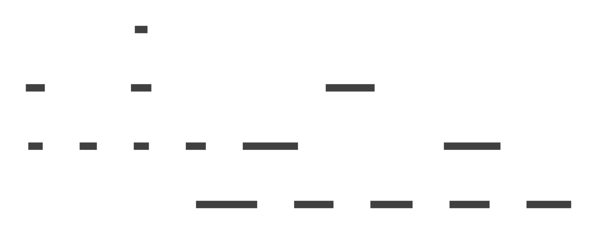

<h1 align="center">Unity Screen Navigator</h1>

[](LICENSE.md)

Library for view transitions, transition animations, transition history stacking, and view lifecycle management in Unity's uGUI.

<p align="center">
  
</p>

## Table of Contents

<!-- START doctoc generated TOC please keep comment here to allow auto update -->
<!-- DON'T EDIT THIS SECTION, INSTEAD RE-RUN doctoc TO UPDATE -->
<details>
<summary>Details</summary>

- [Overview](#overview)
    - [Features](#features)
    - [Demo](#demo)
- [Breaking changes of this fork](#breaking-changes-of-this-fork)
- [Setup](#setup)
    - [Requirement](#requirement)
    - [Install via OpenUPM](#install-via-openupm)
    - [Install via Package Manager](#install-via-package-manager)
- [Basic View Transition](#basic-view-transition)
    - [Concept of views and transitions](#concept-of-views-and-transitions)
    - [Create screen and transition](#create-screen-and-transition)
    - [Create modal and transition](#create-modal-and-transition)
    - [Create sheet and transition](#create-sheet-and-transition)
    - [How to wait for the transition](#how-to-wait-for-the-transition)
    - [Getting containers with static methods](#getting-containers-with-static-methods)
- [View Transition Animation](#view-transition-animation)
    - [Setting common transition animations](#setting-common-transition-animations)
    - [Setting transition animation for each view](#setting-transition-animation-for-each-view)
    - [Change transition animation according to partner screen](#change-transition-animation-according-to-partner-screen)
    - [Screen transition animation and drawing order](#screen-transition-animation-and-drawing-order)
    - [Create simple transition animations easily](#create-simple-transition-animations-easily)
    - [Implement interactive animation with partner screen](#implement-interactive-animation-with-partner-screen)
    - [Create animation with Timeline](#create-animation-with-timeline)
- [Lifecycle Events](#lifecycle-events)
    - [Lifecycle events of the screen](#lifecycle-events-of-the-screen)
    - [Lifecycle events of the modal](#lifecycle-events-of-the-modal)
    - [Lifecycle events of the sheet](#lifecycle-events-of-the-sheet)
    - [Use async methods instead of coroutines](#use-async-methods-instead-of-coroutines)
- [Loading View Resources](#loading-view-resources)
    - [Change the loading method of view resources](#change-the-loading-method-of-view-resources)
    - [Use Addressable Asset System for the loading](#use-addressable-asset-system-for-the-loading)
    - [Load synchronously](#load-synchronously)
    - [Preloading](#preloading)
- [Other Features](#other-features)
    - [Don't stack screens in history](#dont-stack-screens-in-history)
    - [Change the backdrop of modals](#change-the-backdrop-of-modals)
    - [Close the active modal when the backdrop is clicked](#close-the-active-modal-when-the-backdrop-is-clicked)
    - [Enable interaction during transitions](#enable-interaction-during-transitions)
    - [Disable masking for container](#disable-masking-for-container)
- [License](#license)

</details>
<!-- END doctoc generated TOC please keep comment here to allow auto update -->

## Overview

### Features
* You can create screens, modals, tabs and their transitions easily and flexibly.
* Manage view lifecycle and memory from load to destroy.
* Separated workflow with animators for complex view transition animations.
* Well-separated library with no extra functions (ex. GUI library, state machine).
* And standard features such as history stacking and click prevention during transitions.

### Demo
You can play the demo scene with the following steps.

1. Clone this repository.
2. Open and play the following scene.
    * https://github.com/Zitga-Tech/ZBase.UnityScreenNavigator/blob/master/Assets/Samples/Scenes/Demo.unity

Please note that some of the images used in this demo are from the following free contents.
For more information, including copyright, please refer to the following website.

* [JewelSaviorFREE](http://www.jewel-s.jp/)

## Breaking changes in this fork
* Require Unity 2021.3 or higher.
* Rename `Page` to `Screen`.
* Add `Activity` - a type of view which can be freely shown/hidden.
* Add `*Async` methods which depend on `UniTask`.
* Methods without `*Async` suffix are *fire-and-forget* methods.
* Promote the use of `async UniTask` by retiring any use of `CoroutineManager`.
* Many changes regarding the project's structure, asmdefs and namespaces.
* Many improvements on various places.
* Many refactoring regarding class hierarchy.
* :warning: The README might be out-of-date.

## Class Diagram



## Setup

### Requirement
* Unity 2021.3 or higher
* uGUI (UIElements not supported)

### Install via OpenUPM

You can install this package from the [OpenUPM](https://openupm.com/packages/com.zbase.unityscreennavigator/) registry.

More details [here](https://github.com/openupm/openupm-cli#installation).

```
openupm add com.cysharp.unitask
openupm add com.zbase.unityscreennavigator
```

### Install via Package Manager
1. Open the Package Manager from Window > Package Manager
2. `+` button > Add package from git URL
3. Enter the following to install

```
https://github.com/Zitga-Tech/ZBase.UnityScreenNavigator.git?path=/Packages/ZBase.UnityScreenNavigator
```

<p align="center">
  
</p>

Or, open Packages/manifest.json and add the following to the dependencies block.

```json
{
    "dependencies": {
        "com.zbase.unityscreennavigator": "https://github.com/Zitga-Tech/ZBase.UnityScreenNavigator.git?path=/Packages/ZBase.UnityScreenNavigator"
    }
}
```

If you want to set the target version, specify it like follow.

```json
{
    "dependencies": {
        "com.zbase.unityscreennavigator": "https://github.com/Zitga-Tech/ZBase.UnityScreenNavigator.git?path=/Packages/ZBase.UnityScreenNavigator#1.0.0"
    }
}
```

## Basic View Transition

### Concept of views and transitions
Unity Screen Navigator classifies views into 4 types: `Screen`, `Modal`, `Activity` and `Sheet`.

`Screen` is a view that transitions in sequence.
For example, when you transition from the Screen A to Screen B, Screen A will be stacked in the history.
And when you return from Screen B, Screen A will be redisplayed with its states intact.

<p align="center">
  
</p>

`Modal` is a view that is stacked in a window.
When it is displayed, all interactions except for the foreground modal will be blocked.

<p align="center">
  
</p>

And `Sheet` is used for tab-like GUI. History is not managed, and only one active view is displayed.

<p align="center">
  

These types of view can be nested.
And, the area of each view can be freely specified (not necessarily the entire window).

</p>
<p align="center">
  
</p>

Additionally, `Activity` is a view that can be freely shown or hidden, disregarding any other view.

### Create screen and transition
To create the screen transition, first attach the `Screen Container` component to an GameObject under the Canvas.
The screens will be displayed to fit it, so adjust the size.

Next, attach the `Screen` component to the root GameObject of the screen view.
Place this GameObject under the Resources folder with an arbitrary name.

And call `ScreenContainer.Push()` or `ScreenContainer.PushAsync()` with the Resources path to display the screen.
The following is an example of pushing the screen placed in `Assets/Resources/ExampleScreen.prefab`.

```cs
ScreenContainer screenContainer;

// Create options for Push
var options = new ScreenOptions("ExampleScreen", playAnimation: true);

// Push the screen named "ExampleScreen".
// And wait asynchronously for the transition to finish.
await screenContainer.PushAsync(options);
```

Also, use `ScreenContainer.Pop()` or `ScreenContainer.PopAsync()` to discard the active screen and display the previous screen.

```cs
ScreenContainer screenContainer;

// Pop the active screen
// in the fire-and-forget manner.
screenContainer.Pop(playAnimation: true);
```

If you want to skip a certain screen when call `Pop()` or `PopAsync()`, you can [disable stacking to history](#Dont-stack-screens-in-history) by using the optional argument.

### Create modal and transition
To create the modal transition, first attach the `Modal Container` component to an GameObject under the Canvas.
In general, modals are designed to cover the entire window with their backdrop and block clicks.
Therefore, the size of the RectTransform of the GameObject should basically be set to match the window size.

Next, attach the `Modal` component to the root GameObject of the modal view.
This root GameObject will be adjusted to fit the size of the `Modal Container`.
So if you want to create the modal with margins, create a child GameObject with a smaller size and create the content inside it.

<p align="center">
  
</p>

Place this GameObject under the Resources folder with an arbitrary name.

And call `ModalContainer.Push()` or `ModalContainer.PushAsync()` with the Resources path to display the modal.
The following is an example of pushing the modal placed in `Assets/Resources/ExampleModal.prefab`.

```cs
ModalContainer modalContainer;

// Create options for Push
var options = new ModalOptions("ExampleModal", playAnimation: true);

// Push the modal named "ExampleModal".
// And wait asynchronously for the transition to finish.
async modalContainer.PushAsync(options);
```

Also, use `ModalContainer.Pop()` or `ModalContainer.PopAsync()` to discard the active modal and display the previous modal.

```cs
ModalContainer modalContainer;

// Pop the active modal
// in the fire-and-forget manner.
modalContainer.Pop(true);
```

Note that [you can change the modal backdrop](#Change-the-backdrop-of-modals) as you like.

### Create sheet and transition
To create the sheet transition, first attach the "Sheet Container" component to an GameObject under the Canvas.
The sheets will be displayed to fit it, so adjust the size.

Next, attach the `Sheet` component to the root GameObject of the sheet view.
Place this GameObject under the Resources folder with an arbitrary name.

Call `SheetContainer.Register()` or `SheetContainer.RegisterAsync()` with the Resources path to create the sheet.
After it is created, you can change the active sheet by calling `SheetContainer.Show()`.
At this time, if there is already an active sheet, it will be deactivated.

The following is an example of displaying the sheet placed in `Assets/Resources/ExampleSheet.prefab`.

```cs
SheetContainer sheetContainer;

// Instantiate the sheet named "ExampleSheet"
await sheetContainer.RegisterAsync("ExampleSheet");

// Show the sheet named "ExampleSheet"
await sheetContainer.ShowAsync("ExampleSheet", false);
```

Note that when multiple sheets with same resource keys are instantiated by the `RegisterAsync()` method, the identity of the sheet instance cannot guaranteed by the resource key.
In such case, use the sheet ID instead of the resource key, as shown below.

```cs
SheetContainer sheetContainer;

// Instantiate the sheet named "ExampleSheet" and get the sheet id.
var sheetId = await sheetContainer.RegisterAsync("ExampleSheet");

// Show the sheet with sheetId.
await sheetContainer.ShowAsync(sheetId, false);
```

Also, to hide the active sheet instead of switching it, use the `Hide()` or `HideAsync()` method.

```cs
SheetContainer sheetContainer;

// Hide the active sheet.
sheetContainer.Hide(true);
```

### Getting containers with static methods
Each container (`ScreenContainer`/`ModalContainer`/`SheetContainer`/`ActivityContainer`) has static methods to get the instance.

Using the `Container.Of()` as follows, you can get the container that is attached to the nearest parent from the given Transform or RectTransform.

```cs
var screenContainer = ScreenContainer.Of(transform);
var modalContainer = ModalContainer.Of(transform);
var sheetContainer = SheetContainer.Of(transform);
```

Also, you can set the `Name` property in the container's Inspector to get the container by its name.
In this case, use the `Container.Find()` method as follows.

```cs
var screenContainer = ScreenContainer.Find("SomeScreenContainer");
var modalContainer = ModalContainer.Find("SomeModalContainer");
var sheetContainer = SheetContainer.Find("SomeSheetContainer");
```

## View Transition Animation

### Setting common transition animations
By default, a standard transition animation is set for each view type.

You can create a class derived from `TransitionAnimationObject` to create custom transition animation.
This class has a property and methods to define the animation behavior.

```cs
// Duration (sec).
public abstract float Duration { get; }

// Initialize.
public abstract void Setup();

// Define the state at this time.
public abstract void SetTime(float time);
```

Please refer to [SimpleTransitionAnimationObject](https://github.com/Zitga-Tech/ZBase.UnityScreenNavigator/blob/master/Packages/ZBase.UnityScreenNavigator/Runtime/Core/Shared/SimpleTransitionAnimationObject.cs) for the practical implementation.

Then, instantiate this Scriptable Object, and assign it to `UnityScreenNavigatorSettings`.
You can create `UnityScreenNavigatorSettings` from `Assets > Create > Screen Navigator Settings`.

<p align="center">
  
</p>

### Setting transition animation for each view
You can also set up different animation for each view.

Each `Screen`, `Modal`, `Activity`, and `Sheet` component has the `Animation Container` property.
You can set the transition animation to it.

<p align="center">
  
</p>

You can change the transition animation of this view by setting the `Asset Type` to `Scriptable Object` and assigning the `TransitionAnimationObject` described in the previous section to `Animation Object`.

Also, you can use the MonoBehaviour instead of the ScriptableObject.
In this case, first create a class that extends `TransitionAnimationBehaviour` .
Please refer to [SimpleTransitionAnimationBehaviour](https://github.com/Zitga-Tech/ZBase.UnityScreenNavigator/blob/master/Packages/ZBase.UnityScreenNavigator/Runtime/Core/Shared/SimpleTransitionAnimationBehaviour.cs) for the practical implementation.

Then, attach this component and set the `Asset Type` to `Mono Behaviour` and assign the reference to `Animation Behaviour`.

### Change transition animation according to partner screen
For example, when screen A enters and screen B exits, screen B is called the "Partner Screen" of screen A.

If you enter the name of the partner screen in the property shown below, the transition animation will be applied only when this name matches the partner screen name.

<p align="center">
  
</p>

By default, the prefab name is used as the screen name.
If you want to name it explicitly, uncheck `Use Prefab Name As Identifier` and enter a name in the `Identifier` property.

<p align="center">
  
</p>

In addition, regular expressions can be used for the `Partner Screen Identifier Regex`.
And if multiple animations are set, they will be evaluated in order from top.

### Screen transition animation and drawing order
In the transition animation of a screen with a partner screen, the drawing order can be important.
For example, an animation where the screen covers the partner screen.

If you want to control the drawing order, use the `Rendering Order` property.

<p align="center">
  
</p>

During screen transitions, the screen is drawn in the order of decreasing this value.

Note that modals do not have a `Rendering Order` property, since the newest one is always displayed in front.

### Create simple transition animations easily
You can use `SimpleTransitionAnimationObject` as a simple transition animation implementation.

This can be created from `Assets > Create > Screen Navigator > Simple Transition Animation`.
Then, a ScriptableObject as shown below will be generated, and you can set up the animation from the Inspector.

<p align="center">
  
</p>

You can also use `SimpleTransitionAnimationBehaviour` as a MonoBehaviour implementation of this.
This is used by attaching it directly to a GameObject.

<p align="center">
  
</p>

Description of each property is as follows.

|Property Name|Description|
|-|-|
|Delay|Delay time before the animation starts (seconds).|
|Duration|Animation duration (seconds).|
|Ease Type|Type of the easing functions.|
|Before Alignment|Relative position from the container before transition.|
|Before Scale|Scale before transition.|
|Before Alpha|Transparency before transition.|
|After Alignment|Relative position from the container after transition.|
|After Scale|Scale after transition.|
|After Alpha|Transparency after transition.|

### Implement interactive animation with partner screen
You can also create animations that refer to the state of the partner screen.
In the following example, the image of the previous modal is enlarged while seamlessly transitioning to the next modal.

<p align="center">
  
</p>

To implement this, first create a class that derived from `TransitionAnimationObject` or `TransitionAnimationBehaviour`.
Then, refer to the `PartnerRectTransform` property to get the partner screen.
If the partner screen does not exist, `PartnerRectTransform` will be null.

Please refer to [CharacterImageModalTransitionAnimation](https://github.com/Zitga-Tech/ZBase.UnityScreenNavigator/blob/master/Assets/Samples/Scripts/CharacterImageModalTransitionAnimation.cs) in demo for the practical implementation.

### Create animation with Timeline
You can use Timeline to create transition animation.
It is recommended to use Timeline for complex transition animation.

<p align="center">
  
</p>

To implement this, first attach the `Timeline Transition Animation Behaviour` to a GameObject.
And assign `Playable Director` and `Timeline Asset` to properties.

<p align="center">
  
</p>

`Play On Awake` property of `Playable Director` need to be unchecked.

<p align="center">
  
</p>

Finally, assign this `Timeline Transition Animation Behaviour` to the `Animation Container`.

<p align="center">
  
</p>

In addition, I recommend [UnityUIPlayables](https://github.com/Haruma-K/UnityUIPlayables) to create uGUI animations with Timeline.

<p align="center">
  
</p>

## Lifecycle Events

### Lifecycle events of the screen
By overriding following methods in the class derived from the `Screen` class,
you can write the processes associated with the lifecycle of the screen.

```cs
using System;
using Cysharp.Threading.Tasks;

public class SomeScreen : Screen
{
    // Called just after this screen is loaded.
    public override UniTask Initialize(Memory<object> args) { return UniTask.CompletedTask; }

    // Called just before this screen is displayed by the Push transition.
    public override UniTask WillPushEnter() { return UniTask.CompletedTask; }

    // Called just after this screen is displayed by the Push transition.
    public override void DidPushEnter(Memory<object> args) { }

    // Called just before this screen is hidden by the Push transition.
    public override UniTask WillPushExit() { return UniTask.CompletedTask; }

    // Called just after this screen is hidden by the Push transition.
    public override void DidPushExit(Memory<object> args) { }

    // Called just before this screen is displayed by the Pop transition.
    public override UniTask WillPopEnter() { return UniTask.CompletedTask; }

    // Called just after this screen is displayed by the Pop transition.
    public override void DidPopEnter(Memory<object> args) { }

    // Called just before this screen is hidden by the Pop transition.
    public override UniTask WillPopExit() { return UniTask.CompletedTask; }

    // Called just after this screen is hidden by the Pop transition.
    public override void DidPopExit(Memory<object> args) { }

    // Called just before this screen is released.
    public override UniTask Cleanup() { return UniTask.CompletedTask; }
}
```

You can also register lifecycle events externally by registering an object that implements `IScreenLifecycleEvent` to Screen as shown below.
`IScreenLifecycleEvent` is an interface where the above methods are defined.

```cs
IScreenLifecycleEvent lifecycleEventImpl;
Screen screen;
// You can specify the execution priority with the second argument.
// Less than 0: executed before Screen lifecycle event.
// Greater than 1: executed after Screen lifecycle event.
screen.AddLifecycleEvent(lifecycleEventImpl, -1);
```

And you can also hook transition events from the container by passing object that implements `IScreenContainerCallbackReceiver` to `ScreenContainer.AddCallbackReceiver()`.

```cs
using System;

public interface IScreenContainerCallbackReceiver
{
    // Called just before the Push transition is executed.
    void BeforePush(Screen enterScreen, Screen exitScreen, Memory<object> args);

    // Called just after the Push transition is executed.
    void AfterPush(Screen enterScreen, Screen exitScreen, Memory<object> args);

    // Called just before the Pop transition is executed.
    void BeforePop(Screen enterScreen, Screen exitScreen, Memory<object> args);

    // Called just after the Pop transition is executed.
    void AfterPop(Screen enterScreen, Screen exitScreen, Memory<object> args);
}
```

Note that if you implement `IScreenContainerCallbackReceiver` to `MonoBehaviour` and attach it to GameObject of the screen,
it will be registered to `ScreenContainer` without calling `ScreenContainer.AddCallbackReceiver()`.

### Lifecycle events of the modal
By overriding following methods in the class derived from the `Modal` class,
you can write the processes associated with the lifecycle of the modal.

```cs
using System;
using Cysharp.Threading.Tasks;

public class SomeModal : Modal
{
    // Called just after this modal is loaded.
    public override UniTask Initialize() { return UniTask.CompletedTask; }

    // Called just before this model is displayed by the Push transition.
    public override UniTask WillPushEnter() { return UniTask.CompletedTask; }

    // Called just after this modal is displayed by the Push transition.
    public override void DidPushEnter() { }

    // Called just before this modal is hidden by the Push transition.
    public override UniTask WillPushExit() { return UniTask.CompletedTask; }

    // Called just after this modal is hidden by the Push transition.
    public override void DidPushExit() { }

    // Called just before this modal is displayed by the Pop transition.
    public override UniTask WillPopEnter() { return UniTask.CompletedTask; }

    // Called just after this modal is displayed by the Pop transition.
    public override void DidPopEnter() { }

    // Called just before this modal is hidden by the Pop transition.
    public override UniTask WillPopExit() { return UniTask.CompletedTask; }

    // Called just after this modal is hidden by the Pop transition.
    public override void DidPopExit() { }

    // Called just before this modal is released.
    public override UniTask Cleanup() { return UniTask.CompletedTask; }
}
```

You can also register lifecycle events externally by registering an object that implements `IModalLifecycleEvent` to ModalContainer as shown below.
`IModalLifecycleEvent` is an interface where the above methods are defined.

```cs
IModalLifecycleEvent lifecycleEventImpl;
Modal modal;
// You can specify the execution priority with the second argument.
// Less than 0: executed before Modal lifecycle event.
// Greater than 1: executed after Modal lifecycle event.
modal.AddLifecycleEvent(lifecycleEventImpl, -1);
```

And you can also hook transition events from the container by passing object that implements `IModalContainerCallbackReceiver` to `ModalContainer.AddCallbackReceiver()`.

```cs
using System;

public interface IModalContainerCallbackReceiver
{
    // Called just before the Push transition is executed.
    void BeforePush(Modal enterModal, Modal exitModal, Memory<object> args);

    // Called just after the Push transition is executed.
    void AfterPush(Modal enterModal, Modal exitModal, Memory<object> args);

    // Called just before the Pop transition is executed.
    void BeforePop(Modal enterModal, Modal exitModal, Memory<object> args);

    // Called just after the Pop transition is executed.
    void AfterPop(Modal enterModal, Modal exitModal, Memory<object> args);
}
```

Note that if you implement `IModalContainerCallbackReceiver` to `MonoBehaviour` and attach it to GameObject of the modal,
it will be registered to `ModalContainer` without calling `ModalContainer.AddCallbackReceiver()`.

### Lifecycle events of the sheet
By overriding following methods in the class derived from the `Sheet` class,
you can write the processes associated with the lifecycle of the sheet.

```cs
using System;
using Cysharp.Threading.Tasks;

public class SomeSheet : Sheet
{
    // Called just after this sheet is loaded.
    public override UniTask Initialize() { return UniTask.CompletedTask; }

    // Called just before this sheet is displayed.
    public override UniTask WillEnter() { return UniTask.CompletedTask; }

    // Called just after this sheet is displayed.
    public override void DidEnter() { }

    // Called just before this sheet is hidden.
    public override UniTask WillExit() { return UniTask.CompletedTask; }

    // Called just after this sheet is hidden.
    public override void DidExit() { }

    // Called just before this sheet is released.
    public override UniTask Cleanup() { return UniTask.CompletedTask; }
}
```

You can also register lifecycle events externally by registering an object that implements `ISheetLifecycleEvent` to SheetContainer as shown below.
`ISheetLifecycleEvent` is an interface where the above methods are defined.

```cs
ISheetLifecycleEvent lifecycleEventImpl;
Sheet sheet;
// You can specify the execution priority with the second argument.
// Less than 0: executed before Sheet lifecycle event.
// Greater than 1: executed after Sheet lifecycle event.
sheet.AddLifecycleEvent(lifecycleEventImpl, -1);
```

And you can also hook transition events from the container by passing object that implements `ISheetContainerCallbackReceiver` to `SheetContainer.AddCallbackReceiver()`.

```cs
using System;

public interface ISheetContainerCallbackReceiver
{
    // Called just before the Show transition is executed.
    void BeforeShow(Sheet enterSheet, Sheet exitSheet, Memory<object> args);

    // Called just after the Show transition is executed.
    void AfterShow(Sheet enterSheet, Sheet exitSheet, Memory<object> args);

    // Called just before the Hide transition is executed.
    void BeforeHide(Sheet exitSheet, Memory<object> args);

    // Called just after the Hide transition is executed.
    void AfterHide(Sheet exitSheet, Memory<object> args);
}
```

Note that if you implement `ISheetContainerCallbackReceiver` to `MonoBehaviour` and attach it to GameObject of the sheet,
it will be registered to `SheetContainer` without calling `SheetContainer.AddCallbackReceiver()`.

### Use async methods instead of coroutines
You can also use asynchronous methods instead of coroutines to define lifecycle events, as shown below.

```cs
using System;
using Cysharp.Threading.Tasks;
using ZBase.UnityScreenNavigator.Core.Screens;

public class SomeScreen : Screen
{
    // Using asynchronous methods to define lifecycle events
    public override async UniTask Initialize(Memory<object> args)
    {
        await UniTask.Delay(100);
    }
}
```

## Loading View Resources

### Change the loading method of view resources
As mentioned above, by default, the resources of each view are placed in the Resources folder as Prefab.

If you want to change the loading method, first create the Scriptable Object derived from `AssetLoaderObject`.
`AssetLoaderObject` is an implementation of `IAssetLoader`, and has the following methods.

```cs
// Load the resource indicated by the key.
public abstract AssetLoadHandle<T> Load<T>(string key) where T : Object;

// Asynchronously load the resource indicated by the key.
public abstract AssetLoadHandle<T>

// Release the resource indicated by the handle.
public abstract void Release(AssetLoadHandleId handleId);
```

Please refer to [ResourcesAssetLoader](https://github.com/Zitga-Tech/ZBase.UnityScreenNavigator/blob/master/Packages/ZBase.UnityScreenNavigator/Runtime/Foundation/AssetLoader/ResourcesAssetLoader.cs) for the practical implementation.
After create it, assign it's instance to `AssetLoader` property of `UnityScreenNavigatorSettings`.

<p align="center">
  
</p>

You can create `UnityScreenNavigatorSettings` from `Assets > Create > Screen Navigator Settings`.

### Use Addressable Asset System for the loading
An implementation of `IAssetLoader` for the Addressable Asset System is provided by default.
If you want to load each view with an address, follow the steps below to set it up.

1. Select `Assets > Create > Resource Loader > Addressable Asset Loader`
2. Assign the ScriptableObject created in step 1 to the `AssetLoader` property of `UnityScreenNavigatorSettings`.

### Load synchronously
You can pass false as the `loadAsync` argument of each container's transition method to load the view synchronously.
For example, `ScreenContainer.PushAsync()` should be written as follows.

```cs
ScreenContainer container;

// Load resource synchronously.
var options = new ScreenOptions("FooScreen", playAnimation: true, loadAsync: false);
await container.PushAsync(options);
```

In addition, you can initialize it in same frame as the transition method call by using `onLoaded` callback together.

```cs
ScreenContainer container;

// Load resource synchronously and receive the callback after loading.
var options = new ScreenOptions("FooScreen", true, loadAsync: false, onLoaded: (screen, args) =>
{
    // Initialize screen. (Called in the same frame as Push)
    // screen.Setup(args);
});

async container.PushAsync(options);
```

Note that if you use `AddressableAssetLoader` and load synchronously, `Addressables 1.17.4` or higher is required.
In addition, there are performance cautions due to [Addressable's specifications](https://docs.unity3d.com/Packages/com.unity.addressables@1.17/manual/SynchronousAddressables.html).

### Preloading
The screens and the modals are loaded only after a view transition is requested.
When loading a large resource, it may take a long time to load and prevent smooth transitions.

In such a case, it is useful to preload resources in advance.
The following is an example of preloading with `ScreenContainer`.

```cs
const string screenName = "FooScreen";
ScreenContainer container;

// Preload FooScreen.
await container.PreloadAsync(screenName);

// Transition smoothly because FooScreen has been preloaded.
await container.PushAsync(screenName, true);

// Release the preloaded FooScreen.
container.ReleasePreloaded(screenName);
```

Please refer to [HomeScreen in demo](https://github.com/Zitga-Tech/ZBase.UnityScreenNavigator/blob/master/Assets/Samples/Scripts/HomeScreen.cs) for the practical implementation.
When the `HomeScreen` is initialized, the `ShopScreen` is also loaded and destroyed at the same time.

## Other Features

### Don't stack screens in history
There are some screens that you want to skip on transition back, such as loading screen.

In such a case, you can prevent the screen from being stacked in the history by setting the optional argument `stack` to `false` in the `ScreenContainer.Push()`.
The instance of this screen will be disposed when transitioning to the next screen, and thus skipped when backing.

```cs
ScreenContainer container;

// Transition to FooScreen without stacking it in the history.
await container.PushAsync(new ScreenOptions("FooScreen", true, stack: false));

// Transition to BarScreen, and FooScreen is disposed.
await container.PushAsync(new ScreenOptions("BarScreen", true));

// When Pop, it does not back to FooScreen, but to the screen before it.
await container.PopAsync(true);
```

Please refer to [TopScreen in demo](https://github.com/Zitga-Tech/ZBase.UnityScreenNavigator/blob/master/Assets/Samples/Scripts/TopScreen.cs) for the practical implementation.
Transition to the loading screen without stacking.

### Change the backdrop of modals
By default, a black semi-transparent view is set as the modal backdrop.
You can change this in the settings.

To do this, first attach the `Modal Backdrop` component to the modal backdrop view, and make it a prefab.

Next, assign this prefab as the modal backdrop.
To change the modal backdrop of the whole application, assign it to `Modal Backdrop Prefab` in `UnityScreenNavigatorSettings`.

<p align="center">
  
</p>

You can create `UnityScreenNavigatorSettings` from `Assets > Create > Screen Navigator Settings`.

You can also set the backdrop for each `Modal Container` by assigning the prefab to the `Override Backdrop Prefab` of the `Modal Container`.

### Close the active modal when the backdrop is clicked
By default, the backdrop is not clickable.
If you want to close the active modal when the backdrop is clicked, first change the backdrop by the steps above.
Then, check the **Close Modal When Clicked** option of the **Modal Backdrop** component.

<p align="center">
  
</p>

### Enable interaction during transitions
From the start of transition to the end, all interactions such as clicking on the view are disabled.

You can change the settings to enable interaction during the transition.
To do this, set `Enable Interaction In Transition` in `UnityScreenNavigatorSettings` to `true`.

<p align="center">
  
</p>

You can create `UnityScreenNavigatorSettings` from `Assets > Create > Screen Navigator Settings`.

However, it is not possible to transition to other view while transitioning in one container.
So you need to control the transition timing appropriately if you enable interaction.

### Disable masking for container
By default, the part of the view under the container that is outside the container is masked.
If you want to show the view outside the container, uncheck the `Rect Mask 2D` component attached to the container's GameObject.

<p align="center">
  
</p>

## License
This software is released under the MIT License.
You are free to use it within the scope of the license.
However, the following copyright and license notices are required for use.

* https://github.com/Zitga-Tech/ZBase.UnityScreenNavigator/blob/master/LICENSE.md
